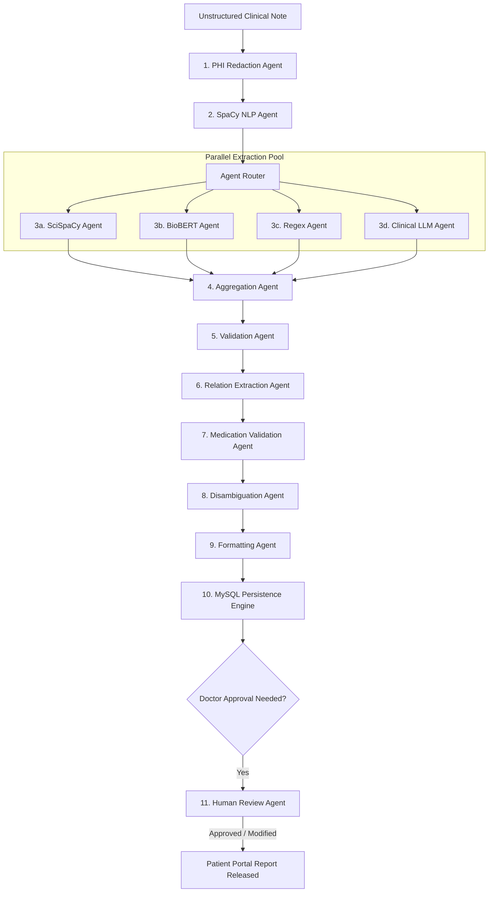
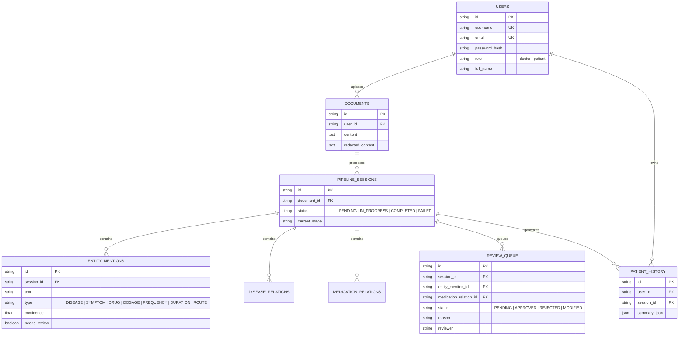

# Multi-Agent Clinical Decision Support & NER System
## Complete Technical Architecture & System Documentation

---

## 1. System Overview

The **Multi-Agent Clinical Information Extraction & Decision Support System** is an enterprise medical NLP and clinical workflow platform. It processes unstructured physician and patient clinical notes, extracts high-precision biomedical entities (Diseases, Symptoms, Drugs, Dosages, Frequencies, Durations, Routes), validates them against medical ontologies (RxNorm, Wikidata, MeSH, DOID), normalizes them via vector similarity search (ChromaDB), and manages a human-in-the-loop doctor review workflow.

```
                  ┌──────────────────────────────────────────────┐
                  │          Patient / Clinical Input            │
                  └──────────────────────┬───────────────────────┘
                                         │
                                         ▼
                  ┌──────────────────────────────────────────────┐
                  │          Multi-Agent Orchestrator            │
                  │             (10 Execution Stages)            │
                  └──────────────────────┬───────────────────────┘
                                         │
              ┌──────────────────────────┼──────────────────────────┐
              ▼                          ▼                          ▼
     ┌─────────────────┐        ┌─────────────────┐        ┌─────────────────┐
     │ Extraction Pool │        │ Knowledge & Vector│        │ Doctor Review   │
     │ 5 Agents        │        │ Validation      │        │ Queue (MySQL)   │
     └─────────────────┘        └─────────────────┘        └─────────────────┘
```

---

## 2. Directory Structure

```
multiagent_system/
├── backend/
│   ├── agents/                     # 13 Specialized Clinical Agents
│   │   ├── phi_redaction_agent.py          # Stage 1: De-identification (HIPAA/GDPR)
│   │   ├── spacy_agent.py                  # Stage 2: Sentence segmentation & POS tagging
│   │   ├── scispacy_agent.py               # Stage 3: Biomedical NER (en_core_sci_sm)
│   │   ├── biobert_agent.py                # Stage 3: Disease NER Transformer
│   │   ├── regex_agent.py                  # Stage 3: Dosage/Frequency/Route regex
│   │   ├── llm_clinical_agent.py           # Stage 3: Clinical NLP & Vocabulary Engine
│   │   ├── aggregation_agent.py            # Stage 4: Weighted voting & consensus
│   │   ├── validation_agent.py             # Stage 5: Taxonomy & confidence thresholding
│   │   ├── relation_extraction_agent.py    # Stage 6: Semantic disease-symptom-drug linking
│   │   ├── medication_validation_agent.py  # Stage 7: RxNorm & Wikidata drug verification
│   │   ├── disambiguation_agent.py         # Stage 8: ChromaDB vector normalization
│   │   ├── formatting_agent.py             # Stage 9: Report & JSON output formatting
│   │   └── human_review_agent.py           # Stage 10: Doctor queue CRUD operations
│   ├── api/                        # FastAPI REST API Endpoints
│   │   ├── auth.py                         # OAuth2 Password JWT & Token Scheme
│   │   ├── routes.py                       # Main API Router & Authentication
│   │   ├── patient_routes.py               # Patient Portal APIs
│   │   └── doctor_routes.py                # Doctor Dashboard & Review Queue APIs
│   ├── database/                   # Database Layer (MySQL / SQLite Fallback)
│   │   ├── connection.py                   # Engine, SessionLocal, Auto-migrations
│   │   ├── models.py                       # SQLAlchemy ORM Data Models
│   │   └── mysql_store.py                  # Persistence & Analytics Store
│   ├── models/                     # Pydantic Pipeline State & Data Transfer Objects
│   │   ├── entity.py                       # EntityMentionModel
│   │   ├── relation.py                     # DiseaseRelation, MedicationDetail, DiseaseSummary
│   │   └── pipeline_state.py               # PipelineState (Context passed through stages)
│   ├── orchestrator/               # Pipeline Execution Controller
│   │   └── coordinator.py                  # 10-Stage Pipeline Coordinator
│   ├── services/                   # External Medical Knowledge Services
│   │   ├── rxnorm_service.py               # NIH RxNorm REST API client
│   │   ├── wikidata_service.py             # Wikidata Medical Sparql client
│   │   └── chroma_service.py               # ChromaDB Vector Database client
│   └── utils/                      # Utilities & Report Generators
│       ├── pdf_generator.py                # ReportLab PDF Generator
│       └── tokenizer.py                    # Text processing helpers
├── frontend/                       # React 18 + Vite Web Application
│   ├── src/
│   │   ├── components/                     # Toast notifications, Navbar
│   │   ├── context/                        # AuthContext & Session management
│   │   ├── pages/                          # PatientDashboard, DoctorDashboard, ReviewQueue, Login
│   │   └── services/api.js                 # Axios Client with FastAPI Error Interceptor
├── config/                         # System & Agent Configuration Files
│   ├── agents.yaml                         # Agent thresholds, weights, and prompts
│   ├── clinical_vocab.json                 # Medical taxonomy & vocabulary databases
│   ├── entity_taxonomy.yaml                # Supported clinical entity types
│   └── pipeline.yaml                       # Pipeline stage parameters
├── run_all.ps1                     # Unified Windows PowerShell launcher & health monitor
└── requirements.txt                # Python Dependencies
```

---

## 3. Detailed Agent Architecture (All 13 Agents)

The core processing engine consists of **13 specialized autonomous agents**, each assigned a specific role in the clinical extraction pipeline:



### Agent Breakdown

| # | Agent Name | File | Primary Responsibility | Technical Mechanism |
|---|------------|------|------------------------|---------------------|
| 1 | **PHI Redaction Agent** | `phi_redaction_agent.py` | Removes patient names, SSNs, phone numbers, addresses, dates of birth to ensure HIPAA compliance before further processing. | Regex + NER PII patterns |
| 2 | **SpaCy NLP Agent** | `spacy_agent.py` | Performs sentence segmentation, POS tagging, and syntactic dependency parsing. | `en_core_web_sm` / Regex fallback |
| 3 | **SciSpaCy Agent** | `scispacy_agent.py` | Extracts general biomedical entities (diseases, symptoms, anatomy). | `en_core_sci_sm` + dictionary matcher |
| 4 | **BioBERT Agent** | `biobert_agent.py` | High-precision disease and diagnosis extraction. | `BioBERT-NER-Diseases` transformer |
| 5 | **Regex Agent** | `regex_agent.py` | Extracts dosages (`500mg`), frequencies (`twice daily`), durations (`for 7 days`), routes (`oral`), and generic drug suffixes (`-statin`, `-cillin`, `-pril`). | Extended regex pattern engine |
| 6 | **Local LLM Agent** | `llm_clinical_agent.py` | Deep context clinical extraction. | Ollama daemon (`phi3:mini`) with dynamic `config/clinical_vocab.json` fallback engine |
| 7 | **Aggregation Agent** | `aggregation_agent.py` | Merges overlapping extractions from all parallel agents into a single unified list using weighted consensus scoring and multi-agent agreement bonuses. | Weighted voting algorithm |
| 8 | **Validation Agent** | `validation_agent.py` | Filters out non-medical stop words, validates entity taxonomy types, and enforces minimum confidence thresholds. | Taxonomy checker & confidence filter |
| 9 | **Relation Extraction Agent** | `relation_extraction_agent.py` | Constructs structured clinical links (`Disease ↔ Symptoms ↔ Medication`). Pairs each drug with its nearest dosage, frequency, and route by text character proximity. | Spatial character-proximity linker |
| 10 | **Medication Validation Agent** | `medication_validation_agent.py` | Verifies prescribed drug names against free medical ontologies (RxNorm API) and validates drug-disease appropriateness. | RxNorm REST API & Wikidata Sparql |
| 11 | **Disambiguation Agent** | `disambiguation_agent.py` | Normalizes entity surface text to canonical terminology using vector similarity search. | ChromaDB + `all-MiniLM-L6-v2` embeddings |
| 12 | **Formatting Agent** | `formatting_agent.py` | Generates final structured JSON summary and patient/physician readable text summaries. | JSON & Markdown report formatter |
| 13 | **Human Review Agent** | `human_review_agent.py` | Manages doctor review operations (Approve, Reject, Modify, Approve All) in the MySQL database. | MySQL store CRUD controller |

---

## 4. 10-Stage Execution Pipeline

When a clinical note is submitted, the **Coordinator** (`backend/orchestrator/coordinator.py`) executes the note through **10 sequential stages**:

1. **Stage 1 (PHI_REDACTION)**: Scans and redacts PII/PHI. Logs redaction audit entries.
2. **Stage 2 (NLP_SEGMENTATION)**: Splits document into sentences and extracts POS tags.
3. **Stage 3 (EXTRACTION)**: Fires parallel extraction agents (`scispacy`, `biobert`, `regex`, `local_llm`).
4. **Stage 4 (AGGREGATION)**: Merges raw entity mentions using formula:
   $$\text{Confidence} = \min\left(0.99, \frac{\sum w_i c_i}{\sum w_i} + 0.05 \times (N_{\text{agents}} - 1)\right)$$
5. **Stage 5 (VALIDATION)**: Purges blacklisted terms ("patient", "report", etc.) and enforces minimum threshold ($0.60$).
6. **Stage 6 (RELATION_EXTRACTION)**: Links diseases, symptoms, and medications into structured `DiseaseSummaryModel` objects.
7. **Stage 7 (MEDICATION_VALIDATION)**: Queries RxNorm and Wikidata APIs for drug existence and appropriateness.
8. **Stage 8 (DISAMBIGUATION)**: Matches extracted terms against canonical vector database (ChromaDB).
9. **Stage 9 (FORMATTING)**: Formats clinical summary for patient UI and doctor view.
10. **Stage 10 (PERSISTENCE & REVIEW QUEUE)**:
    - Saves entity mentions, relations, and patient history into MySQL.
    - Creates a `PENDING` entry in `review_queue` for doctor sign-off.
    - Returns `PENDING_REVIEW` status to patient.

---

## 5. Database Schema (MySQL / SQLAlchemy)

The database schema (`backend/database/models.py`) manages users, documents, extraction sessions, entities, relations, audit logs, and the review queue:



---

## 6. Doctor Approval & Patient Portal Workflow

The system enforces a **strict physician precheck workflow** to ensure safety before clinical summaries reach patients:

1. **Patient Submission**: Patient submits note via `/api/patient/submit-note`.
2. **Pipeline Execution**: All 10 stages run automatically.
3. **Pending State**: API returns status `PENDING_REVIEW`. The report is hidden from the patient history.
4. **Doctor Review Queue**: The note appears in the doctor's queue (`GET /api/doctor/review-queue`) showing:
   - Full submitted clinical note.
   - AI-extracted diseases, symptoms, and medications.
5. **Doctor Decision**:
   - **Approve**: Releases AI report directly to patient.
   - **Modify**: Doctor adds clinical observations or corrects dosages, then releases report.
   - **Reject**: Marks note as invalid/rejected.
6. **Patient Portal Update**: The patient history status updates to `✅ Doctor Approved`, unlocking full report viewing and PDF download (`GET /api/patient/download-pdf/{session_id}`).

---

## 7. REST API Reference

### Authentication (`/api/auth`)
- `POST /api/auth/register`: Register new doctor or patient user.
- `POST /api/auth/login`: Authenticate and receive JWT bearer token.
- `POST /api/auth/token`: OAuth2 password form-data token endpoint (for Swagger UI).

### Patient Portal (`/api/patient`)
- `POST /api/patient/submit-note`: Submit clinical note for multi-agent extraction.
- `GET /api/patient/history`: List past submissions with approval status (`PENDING_REVIEW` / `APPROVED` / `REJECTED`).
- `GET /api/patient/summary/{session_id}`: Retrieve detailed patient summary (requires doctor approval).
- `GET /api/patient/download-pdf/{session_id}`: Download official clinical PDF report.

### Doctor Portal (`/api/doctor`)
- `GET /api/doctor/dashboard`: Overall clinical system analytics (total notes, pending reviews, disease counts).
- `GET /api/doctor/review-queue`: List all pending patient notes and flagged extractions requiring review.
- `POST /api/doctor/review/{review_id}/action`: Approve, reject, or modify a review item (`{"action": "APPROVED", "reviewer": "Dr. Name"}`).
- `POST /api/doctor/review/approve-all`: Batch approve all pending review items.
- `GET /api/doctor/patient-history`: Search patient medical history across the hospital system.
